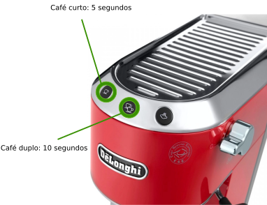
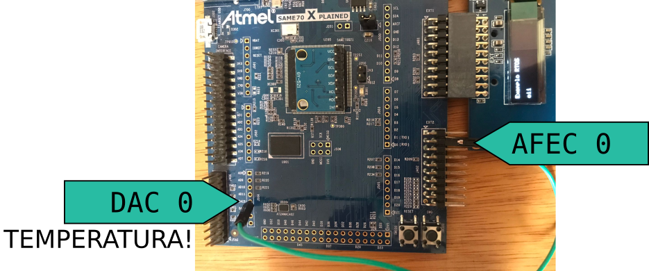

# 21b - Avaliação Prática 2

Leia atentamente as informações a seguir:

1. Atualize o arquivo `ALUNO.json` com seu nome e e-mail e faça um commit imediatamente.
1. **Faça o seu trabalho de maneira ética!**
1. **A cada 30 minutos você deverá fazer um commit no seu código!**
    - Códigos que não tiverem commit a cada 30min ou que mudarem drasticamente entre os commits serão descartados (conceito I) !!
    - Você deve inserir mensagens condizentes nos commits!
1. Duração: 3h
1. Usar o código exemplo deste repositório, ele já possui:
    - Diplay do módulo OLED1
    - TC/ RTT/ RTC/ AFEC já adicionados no ASF Wizard
    - Deve utilizar o rtos e suas funcionalidades.

:triangular_flag_on_post: **Ao finalizar a entrega preencher o formulário (uma única vez!):**

https://docs.google.com/forms/d/e/1FAIpQLSfh8Cnc7djWaZ2nmf0ngAfRCuQnj2WnINXu8P4Chsb3GY2GJQ/viewform

Acessar a avaliacao pelo link:

https://classroom.github.com/a/jVdEb6Lh

## Descrição

Nesta entrega vocês irão desenvolver um controlador para uma máquina de café expresso! O sistema possui dois botões para o usuário selecionar a quantidade de café: Simples ou Duplo. A ideia aqui é controlar o quanto de café será feito através do tempo na qual a bomba da máquina fica ligada.

Antes de permitir que o usuário sedento por cafeína faca o café você deve iniciar o aquecimento da máquina e garantir que ela esteja quente o suficiente antes de iniciar a passagem da água. Isso será realizado lendo a temperatura da máquina via uma entrada analógica. O controle do aquecedor será realizado via a chamada de duas funções.



### Interação com a máquina

A máquina de café possui três dispositivos que vocês precisam interagir: Aquecedor (**FLOW HEATER**); Sensor de Temperatura da água e Bomba de água (**PUMP**), como detalhado a seguir:


> REF: https://knowyourgrinder.com/wp-content/uploads/2016/01/illy_competition_schema.png

#### Aquecedor

Sistema ON/OFF que aquece a água para fazer o café, deve ser controlado com as funções a seguir:

``` c
// Controle do aquecimento
void coffee_heat_on(void);  // aquece a água
void coffee_heat_off(void); // desliga o aquecimento da água
```

> As funções já estão implementadas!

#### Sensor de temperatura

Você deve realizar a leitura analógica do pino **DAC0** que indica a temperatura atual do reservatório de água, para converter o valor lido na entrada analógica para graus célcios utilize a fórmula a seguir:

``` 
Temperatura_celcios =  100 * AFEC
                      ------------
                        4095
```

- **AFEC** é o valor digital lido via conversão analógica digital.

A temperatura do reservatório é gerada no pino DAC0, para ler o valor você deve conectar o pino em uma entrada analógica.

```c
  |----------|    temperatura
  |     dac0 |------->|
  |          |        |
  |  afec0 0 |<-------| ligar com jump!
  |----------|
```



> Dicas:
> 
> 1. Para leitura do dado analógico usar o AFEC0 canal 0 (EXT2 PIN 3)
> 1. 1s de taxa de amostragem é mais que o suficiente.

#### Bomba de água

O controle da bomba de água (que faz o café) deve ser realizado via as funções a seguir (já implementadas):

```c
// Controle da bomba
void coffee_pump_on();  // liga bomba
void coffee_pump_off(); // desliga bomba
```

Ao fazer o café a temperatura da água irá baixar, por conta disso você não deve verificar a temperatura da água enquanto estiver fazendo o café, apenas antes do inicio do processo.

#### Tipos de café 

A máquina deve produzir dois tipos de café: Simples e Duplo, a diferença entre eles é: o botão que ativa o modo, o tempo na qual o café a bomba ficará ligada.

| Modo    | Botão  | LED    | Tempo |
|---------|--------|--------|-------|
| Simples | BTN 1 | LED 1 |  5s   |
| Duplo   | BTN 2 | LED 2 |  10s  |

#### OLED

Você deve exibir no OLED as seguintes informações:

- Estado da cafeteira: Aquecendo/ Pronta para fazer café/ Fazendo café
- Quando tiver fazendo café indicar o modo selecionado (Simples/ Duplo)
 
> TIP: Isso serve para ajudar vocês na implementação!

#### Comportamento

Ao ligar a máquina (placa energizada) o sistema deve começar a aquecer a água e bloquear qualquer ação do usuário de fazer café até a temperatura atingir 80C, enquanto isso vocês devem exibir **Aquecendo** no OLED.

Com a água atingido a temperatura certa você deve exibir **Pronta** no OLED e a máquina já pode aceitar um pedido de café. Quando um dos modos forem selecionados lembrar de ligar a bomba e deixar ela ligada pelo tempo definido (5s ou 10s), ao acabar o tempo desligar a bomba!. 

- Vocês devem utilizar RTT para medir o tempo (5s ou 10s);
- Usem os recursos do RTOS para comunicar Handler / Task

Quando selecionado um modo de operação lembrar de exibir no OLED: **Simples** ou **Duplo**. A comunicação dos botões com a task também deve ser feita com recursos do RTOS.

Após acabar o processo de fazer café, o sistema deve verificar a temperatura da água antes de permitir que um novo café seja feito (a passagem da água esfria 'a água na câmara).

:bangbang: A máquina só deve liberar para fazer café quando a temperatura da água atingir pelo menos 80°C.

### Código fornecido

O código fornecido tem uma task oculta (`xTaskCreate(task_av2,....`) que emula a máquina de café real, você não deve mexer nessa função! Para ajudar vocês eu imprimo um log da máquina no terminal, que contém informações sobre a temperatura, aquecimento e bomba.

```
[PUMP] ON 
[TEMP] 87, [HEAT] 1, [PUMP] 1 
[TEMP] 84, [HEAT] 1, [PUMP] 1 
[TEMP] 81, [HEAT] 1, [PUMP] 1 
[TEMP] 78, [HEAT] 1, [PUMP] 1 
[TEMP] 75, [HEAT] 1, [PUMP] 1 
[TEMP] 72, [HEAT] 1, [PUMP] 1 
```

### Dicas

1. Usem o terminal para debugar
1. Usem breakpoint!
1. Antes de qualquer coisa, comecem aquecer a água! Lembrem que o individuo é necessitado de café!
1. Façam toda implementação na task_oled
1. Implementem por parte:
    - leitura analógica (com fila, ou semáforo!!)
    - conversão de ADC para célcios (cuidado os tipos de variável)
1. Lógica dos botões
    - com fila ou semáforo!
1. Lógica de controle da bomba 
    - lembrem do RTT!
1. A cada etapa lembrem de atualizar o OLED com as informações! Isso vai ajudar vocês
1. Testem sempre e bastante! Apertem o botão enquanto estiver aquecendo... nada pode acontecer! 

## C

Requisitos funcionais (resumo):

- Cafe simples/ Duplo funcionando
    - controlar a bomba com as funções: `coffee_pump_on` e `coffee_pump_off()`
- Aquecer a máquina chamando a função: `coffee_heat_on()`
- Só permitir que o café seja feito com a água no mínimo 80C.

Assista ao vídeo no youtube para ver o comportamento da máquina:

https://www.youtube.com/watch?v=_0tqHtVparQ

E de onde veio a ideia original:

https://www.youtube.com/watch?v=JsnlxMmlMTg

Requisitos técnicos:

- Usar RTT para calcular o tempo que a bomba vai ficar ligada.
- Usar AFEC para leitura da temperatura.
- Usar fila e semáforos para troca de dados.

## C+ - stand-by

Identificar quando a máquina está inativa (20 segundos sem uso) e desligar o aquecimento da água e desligar os LEDs entrando em modo stand-by. Quando qualquer botão for apertado ligar novamente a máquina (com o mesmo comportamento de quando ela é ligada pela primeira vez).

> Enquanto em stand-by os LEDs devem ficar apagados

## B - Pisca os LEDs

Os LEDS referentes a cada botão devem se comportar da seguinte maneira:

- Piscar todos os LEDS enquanto a temperatura da máquina não chegou em 80 C
- Ao chegar na temperatura mínima manter os LEDs acessos para indicar que a máquina está pronta para fazer um café.
- Quando estiver produzindo um café o LED do modo selecionado deve piscar enquanto estiver produzindo café, os demais devem manter apagado.

Implementa a parte de piscar os LEDs quando estiver aguardando o aquecimento da bomba e quando tiver fazendo um café.

- Usar TC para piscar os LEDs.

## B+ - Barra de progrssso

Exibir no OLED uma barra de progresso enquanto estiver fazendo o café. 

## A - Tempo

Possibilitar que o usuário altere o tempo de cada tipo de café (Simples, Duplo). Se o usuário apertar e manter o botão pressionado o tempo na qual ele manteve o botão pressionado deve ser a nova base de tempo para o modo em questão. Enquanto o botão estiver pressionado lembre de ligar a bomba, e quando soltar desligar!

Exiba o novo tempo no OLED para facilitar o debug!
